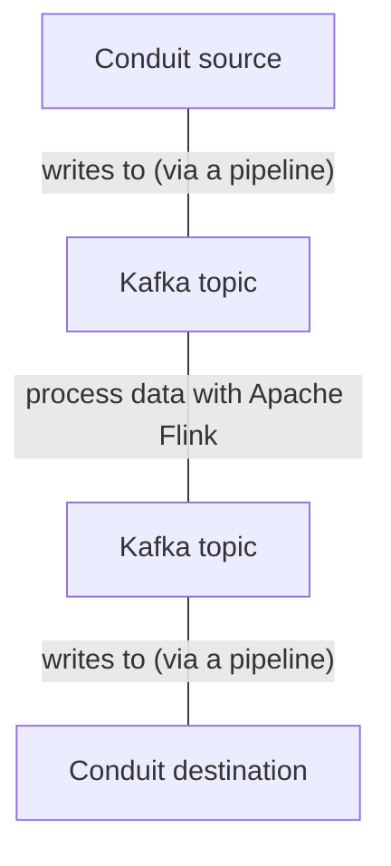

# Conduit source and sink for Flink

This project provides a [Conduit](https://conduit.io) source and sink for [Apache Flink®](https://flink.apache.org).
This makes it possible to use
any [Conduit source or destination connector](https://conduit.io/docs/connectors/getting-started) with Apache Flink.

### How it works

Under the hood, a Flink job that reads from a Conduit source and writes to a Conduit destination uses Kafka as an
intermediary. A Conduit source for Apache Flink is actually a Conduit pipeline that reads from any source that Conduit
supports and then writes to a Kafka topic. Similarly, a Conduit sink for Apache Flink is a Conduit pipeline that reads
from a Kafka topic and then writes to any available Conduit destination.



### Usage

Add the following Maven dependency:

```xml

<dependency>
    <groupId>com.meroxa</groupId>
    <artifactId>conduit-flink-connector</artifactId>
    <version>0.1.0-SNAPSHOT</version>
</dependency>
```

Then, follow one of the [example](/src/main/java/examples) to build a Flink job.

### Configuration

- **`conduit.url`**
    - *Description:* Conduit instance's base path
    - *Required:* no
    - *Default:* `http://localhost:8080`
- **`conduit.kafka.servers`**
    - *Description:* Kafka bootstrap servers
    - *Required:* no
    - *Default:* `localhost:9092`
- **`conduit.source.pipeline.topic`**
    - *Description:* Name of the Kafka topic from which the Flink job will be reading data from
    - *Required:* no
    - *Default:* `flink-topic-source`
- **`conduit.destination.pipeline.topic`**
    - *Description:* Name of the Kafka topic from which the Flink job will be writing data to
    - *Required:* no
    - *Default:* `flink-topic-sink`
